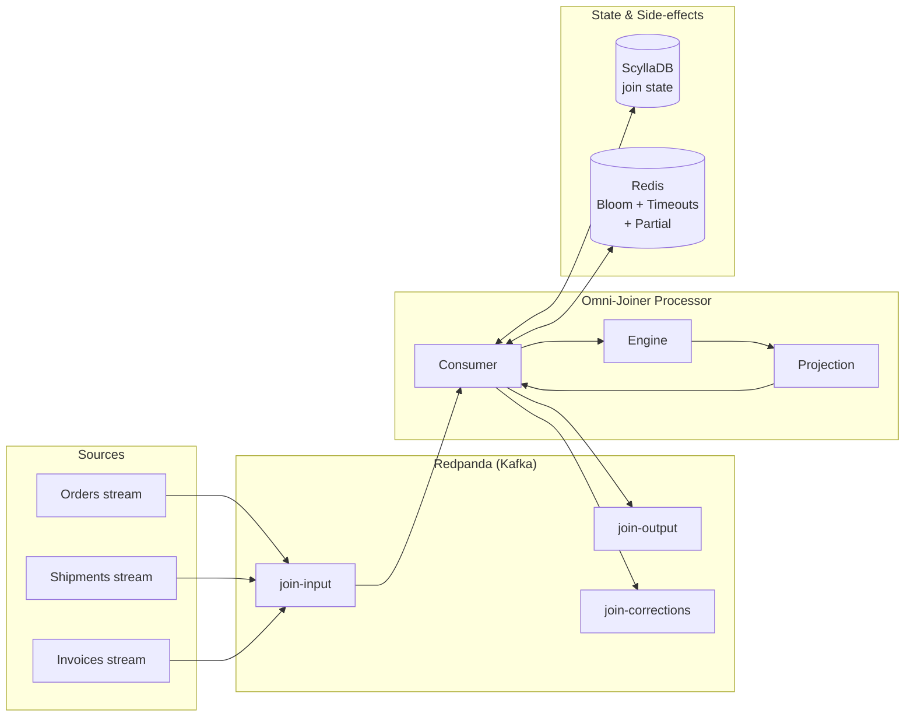
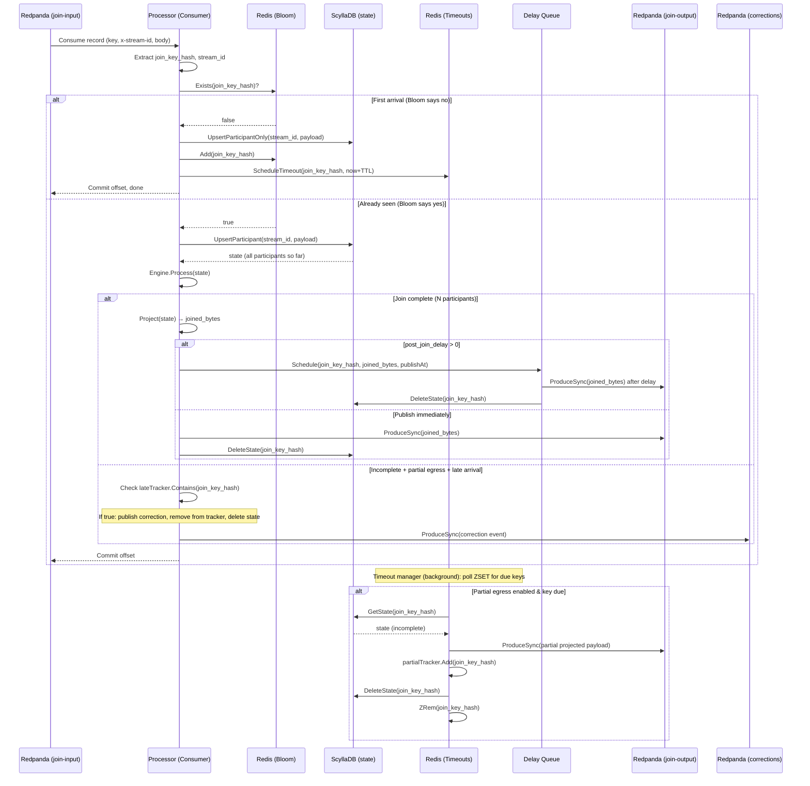

# Omni-Joiner Architecture

This document describes the role of each infrastructure component, how joins are performed (with flow and sequence diagrams), and what join types are supported with examples.

---

## 1. Component Roles

### Redpanda (Kafka API)

| Role | Details |
|------|--------|
| **Input topic** | Single topic (e.g. `join-input`) where all streams publish events. Each message must include the header **`x-stream-id`** (e.g. `orders`, `shipments`) and a JSON body containing the join key field(s). The Kafka message **key** should equal the join key (or its hash) so that all events for the same key land in the same partition and are processed in order. |
| **Output topic** | Joined results are produced here (e.g. `join-output`). One message per completed join, keyed by join key. |
| **Corrections topic** (optional) | When **partial egress** is enabled and a **late arrival** occurs, correction events are produced here so downstream can upsert over a previously published partial. |

**Why Redpanda:** Kafka-compatible; the processor uses the **franz-go** client and is validated with Redpanda v24.

---

### ScyllaDB (Join State Store)

| Role | Details |
|------|--------|
| **Persistent join state** | One row per join key (`join_key_hash` as primary key). Each row holds: `participant_data` (map of stream ID → JSON payload), `arrival_timestamps`, `config_id`, `join_key_raw`. |
| **Atomic updates** | On each event, the processor **upserts** that stream's payload into the row (map update). A follow-up read returns the full state so the engine can decide if the join is complete (all N streams present). |
| **TTL** | Rows can use a table-level or application-managed TTL; the **timeout manager** (Redis-backed) decides when to treat a key as timed out for partial egress. |

**Why ScyllaDB:** High write throughput, good for key-value style state; CQL map updates allow atomic "add one participant" without read-modify-write in the processor.

---

### Redis (Bloom, Timeouts, Partial Tracker)

| Role | Details |
|------|--------|
| **Bloom filter** (RedisBloom) | **"Has this join key been seen?"** Before doing a full read from ScyllaDB, the processor checks the Bloom filter. If the key is **not** present, it's a first arrival: the processor does an **update-only** (no read-back) in ScyllaDB, then adds the key to the Bloom filter. This reduces read load on ScyllaDB for first arrivals. |
| **Timeout set** (ZSET) | For each new join key, the processor schedules a **deadline** (e.g. now + TTL) in a Redis sorted set. A background **timeout manager** polls for due keys and, when **partial egress** is enabled, publishes the current (incomplete) state to the egress topic and records the key in the partial tracker. |
| **Partial tracker** (set) | Keys that received **partial egress** are stored here. If a **late arrival** event later completes the join, the processor publishes a **correction event** to the corrections topic and removes the key from this set. |

**Why Redis:** Low latency for Bloom checks and ZSET operations; Redis Stack provides RedisBloom; same process can run the consumer loop and the timeout poller.

---

## 2. High-Level Flow (Component Diagram)

---

## 3. Join Processing Sequence (Sequence Diagram)

The following diagram shows the path for a **single event**: first arrival (Bloom says "not seen") vs. later arrival (Bloom says "maybe seen"), then completion check and optional delay/correction.

---

## 4. Join Types Supported (With Examples)

### 4.1 Inner Join (2-way or N-way)

**Config:** `egress: "inner"`. A joined record is published **only when all N streams** have contributed an event for that join key.

**Example (2-way):** `orders` and `shipments` on `order_id`.

- **Join config:** `config/join_inner.json` — `stream_ids: ["orders", "shipments"]`, `key.field: "order_id"`, `egress: "inner"`.
- **Input events (on `join-input`):**
  - `{"order_id":"ord-1","price":99.99}` with header `x-stream-id: orders`, key `ord-1`
  - `{"order_id":"ord-1","status":"shipped"}` with header `x-stream-id: shipments`, key `ord-1`
- **Output (on `join-output`):** One message per key when both streams have arrived, e.g.  
  `{"order_id":"ord-1","price":99.99,"status":"shipped"}` with key `ord-1`.

**Example (3-way):** `config/join_three_way.json` — `stream_ids: ["orders", "shipments", "invoices"]`, same key `order_id`. Joined output is emitted only when all three have sent an event for that key.

---

### 4.2 Partial Egress (Timeout-Based)

**Config:** `egress: "partial"` and a **TTL** (e.g. `"60s"`). If **not all** streams have arrived by the TTL, the processor still publishes whatever it has (partial result) to the egress topic and records the key for **late-arrival corrections**.

**Example:** `config/join_partial.json` — `egress: "partial"`, `ttl: "60s"`.

- **Scenario 1:** Only `orders` event for `ord-1` arrives. After 60s, timeout manager publishes a partial: e.g. `{"order_id":"ord-1","price":99.99,"status":null}` (or only present fields). Key `ord-1` is added to the **partial tracker**.
- **Scenario 2:** Later, `shipments` event for `ord-1` arrives. Processor sees the key in the partial tracker, builds the full projected payload, and publishes a **correction event** to `join-corrections` with `kind: "late"` and the full payload so downstream can overwrite the partial.

Requires **Redis** (timeout ZSET + partial tracker) and a **corrections topic** in the processor config.

---

### 4.3 Post-Join Delay

**Config:** `post_join_delay` (e.g. `"2s"`). When the join **completes**, the result is not published immediately; it is scheduled in an internal **delay queue** and published after the delay. Use for "settle" semantics (e.g. allow late duplicates to arrive before publishing).

**Example:** `config/join_with_delay.json` — `post_join_delay: 2000000000` (2s in nanoseconds). Inner join semantics unchanged; only the publish step is delayed.

---

### 4.4 Composite Key

**Config:** `key.fields: ["tenant_id", "order_id"]` (ordered list). The join key is built from multiple JSON fields; the same key ordering is used for hashing and partitioning.

**Example:** `config/join_composite_key.json` — `stream_ids: ["stream_a", "stream_b"]`, `key.fields: ["tenant_id", "order_id"]`. Input events must contain both fields, e.g.  
`{"tenant_id":"acme","order_id":"o1","value":100}` with header `x-stream-id: stream_b`. Joined output includes the projected fields from both streams for that composite key.

---

## 5. Summary: What Is Supported Today

| Feature | Supported | Config / Notes |
|--------|-----------|-----------------|
| **Inner join** | Yes | `egress: "inner"`, any N streams |
| **Partial egress** | Yes | `egress: "partial"`, TTL in config, Redis + corrections topic |
| **Post-join delay** | Yes | `post_join_delay` (duration) |
| **Single-field join key** | Yes | `key.field: "order_id"` |
| **Composite join key** | Yes | `key.fields: ["tenant_id", "order_id"]` |
| **2-way join** | Yes | `stream_ids: ["A", "B"]` |
| **3-way (or N-way) join** | Yes | `stream_ids: ["orders", "shipments", "invoices"]` |
| **Late-arrival corrections** | Yes | With partial egress + corrections topic + Redis partial tracker |
| **Outer join** | No | Only inner and partial (timeout) semantics |
| **Left/right join** | No | Not implemented |

---

## 6. Where to Go Next

- **Running and testing:** [TESTING.md](TESTING.md) — topics, produce script, configs.
- **Ordering and partitioning:** [ORDERING.md](ORDERING.md) — Kafka key = join key.
- **Late arrival and corrections:** [LATE_ARRIVAL.md](LATE_ARRIVAL.md) — schema and downstream upserts.
- **Design and roadmap:** [Omni-Joiner_ Stream Joining Platform Design.md](../Omni-Joiner_%20Stream%20Joining%20Platform%20Design.md).
